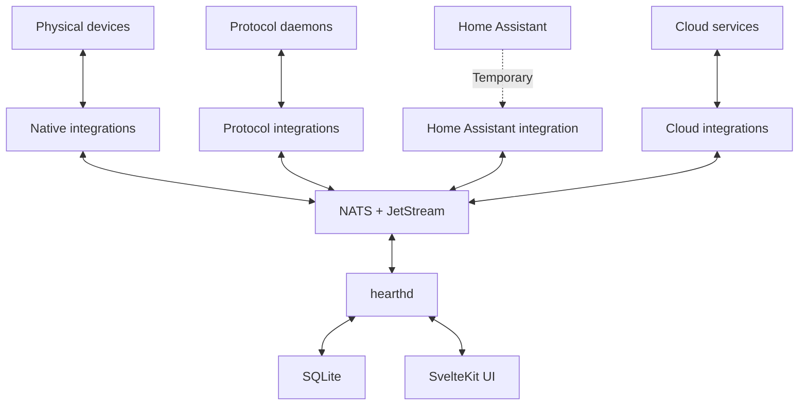
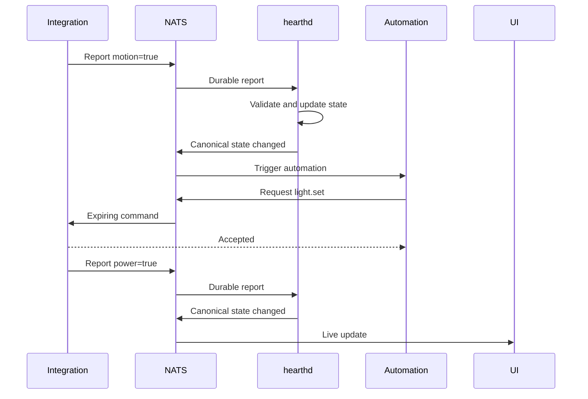
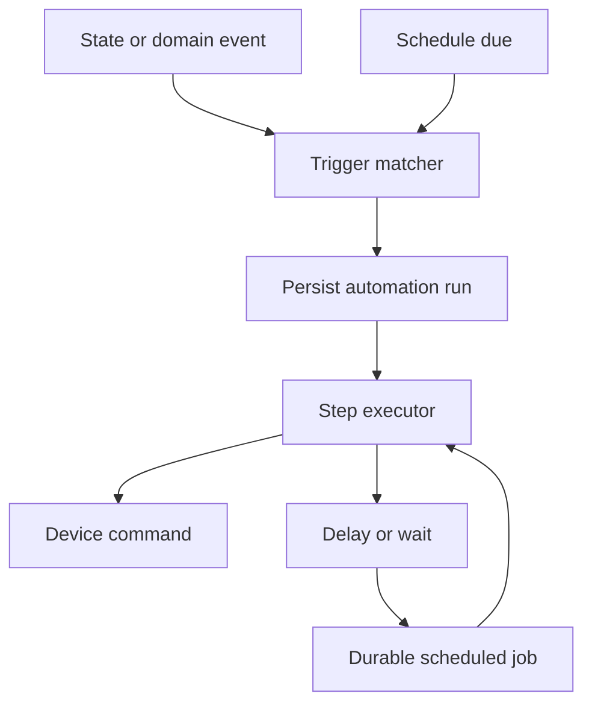
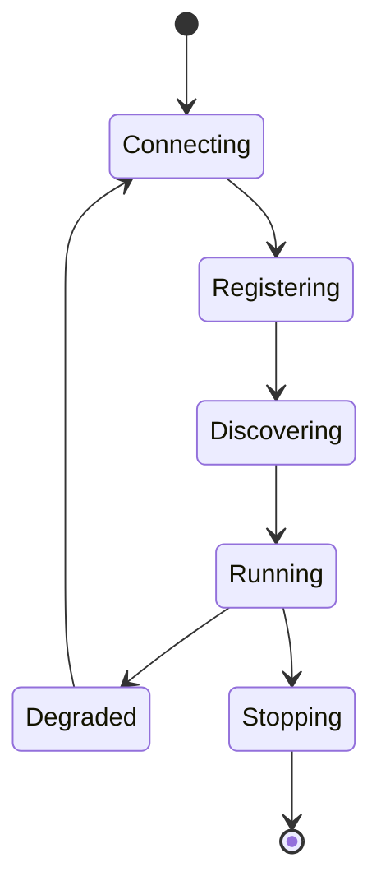

> **Non-authoritative imported draft.** This document is source material for design discussion, not the current architecture or a record of accepted decisions. See [`../architecture.md`](../architecture.md) and [`../adr/`](../adr/) for the current state.

# Hearthd

## A NATS-native home automation platform

**Status:** Initial architecture
**Primary goal:** Learn NATS by building a local-first home automation system that can eventually replace Home Assistant for this home
**Implementation:** Go, NATS/JetStream, SQLite, SvelteKit, Docker Compose

---

## 1. Project vision

Hearthd is a local-first, event-driven home automation platform built around NATS. Its long-term purpose is to replace Home Assistant for this home, but it is not intended to reproduce every Home Assistant feature or match its integration ecosystem. Instead, it focuses on the capabilities this installation actually needs, with especially strong event modeling, reliability, observability, and integration boundaries.

The existing Home Assistant installation acts as the first integration bridge and temporary compatibility layer. This provides immediate access to real devices while Hearthd gradually adds direct integrations for systems such as OpenSprinkler, MQTT, weather providers, protocol coordinators, and other local or cloud APIs. Home Assistant must not become a foundational dependency of the core.

The central design rule is:

> NATS transports facts and intentions; services own behavior; databases provide durable and queryable models.

### Goals

- Learn Core NATS, JetStream, KV, request/reply, queue groups, permissions, and failure recovery in a realistic system.
- Build a genuinely useful automation platform rather than a messaging demonstration.
- Keep device and vendor code outside the automation core.
- Make automations understandable through complete causal traces.
- Remain local-first and comfortable to operate in a homelab with Docker Compose.
- Permit integrations written in any language through a stable wire protocol.
- Start small without preventing later service extraction.
- Transfer devices from Home Assistant to native integrations without changing their canonical IDs or automations.
- Eventually operate for an extended period with Home Assistant completely shut down.

### Non-goals for the initial project

- Feature parity with the full Home Assistant product and ecosystem.
- Reimplementing radio protocols such as Zigbee, Z-Wave, Matter, and Bluetooth from their wire specifications.
- Kubernetes or a large microservice deployment.
- A browser that connects directly to NATS.
- Runtime-loaded Go plugins or shared libraries.
- Using NATS as a replacement for every database.

### Relationship to Home Assistant

Home Assistant is a migration source, not the product architecture. Hearthd can continue using mature protocol services such as Zigbee2MQTT, Z-Wave JS, and Matter controller/server processes; replacing Home Assistant does not require replacing every specialist protocol implementation.

The migration path for each device is:

```text
Home Assistant-owned
    -> native integration discovered in shadow mode
    -> observations compared
    -> canonical ownership transferred
    -> Home Assistant mapping retained for rollback
    -> old mapping retired
```

The final practical acceptance test is to run the required home automation system for at least one week with Home Assistant shut down, without losing device control, automations, schedules, alerts, history, or recovery behavior.

### How Hearthd differs from Home Assistant

Hearthd is not differentiated merely by having devices, entities, integrations, schedules, history, automation modes, or traces. Home Assistant already provides those capabilities. The difference is that Hearthd treats home automation as a durable distributed system.

| Area | Home Assistant | Hearthd |
| --- | --- | --- |
| Event fabric | Central event bus and state machine inside Core | NATS is a versioned, network-visible system boundary |
| Durability | Recorder persists processed state changes and events for history | JetStream events are replayable processing inputs for durable consumers |
| Integrations | Primarily Python components designed for the Home Assistant runtime | Isolated processes or containers speaking a language-neutral contract |
| State ingestion | An integration updates an entity in the central state machine | Raw report -> validation -> canonical state projection -> state-change event |
| Commands | Service/action invocation | Expiring intent with actor, idempotency, acceptance, and optional physical confirmation |
| Automations | Runtime scripts reacting to triggers | Persisted workflow runs with durable steps, waits, and wake-ups |
| Scheduling | Runtime time triggers, delays, and waits | SQLite-backed jobs with timezones, leases, misfire policies, and an outbox |
| Debugging | Step-by-step automation trace | Distributed causal trace from observation through physical confirmation |
| Failure model | Primarily coordinated within one application | Every boundary assumes disconnection, redelivery, duplication, and restart |
| Migration | Integrations directly provide entities | Canonical devices can transfer between integration owners |

The concise project identity is:

> Hearthd is a NATS-native home automation platform built around durable workflows, isolated integrations, replayable events, explicit device-command semantics, and end-to-end causal tracing.

The defining experiment is not simply turning on a light. It is interrupting the automation engine and device integration at different points, restarting them, redelivering the original event, and proving that Hearthd recovers without unsafe duplicate effects while explaining exactly what happened.

This architecture has a real cost: more processes, eventual consistency, contract versioning, and substantially more operational complexity. Home Assistant optimizes for a huge ecosystem and accessible automation; Hearthd deliberately optimizes for isolation, replay, durability, and explainability.

Relevant Home Assistant reference points include its [core architecture](https://developers.home-assistant.io/docs/architecture/core/), [integration execution model](https://developers.home-assistant.io/docs/asyncio_index/), [Recorder](https://www.home-assistant.io/integrations/recorder/), [automation modes](https://www.home-assistant.io/docs/automation/modes/), and [automation traces](https://www.home-assistant.io/docs/automation/troubleshooting/).

---

## 2. High-level architecture

Hearthd begins with three Go binaries, plus NATS and the web application:

| Deployment unit | Responsibility |
| --- | --- |
| `hearthd` | Registry, canonical state, automations, scheduler, recorder, HTTP API, SSE, and webhook ingress |
| `hearth-integration-homeassistant` | Connects to Home Assistant, discovers entities, reports state, and translates commands |
| `hearth-simulator` | Provides virtual devices and controlled failure scenarios for development |
| `nats` | Core messaging, JetStream streams and consumers, KV, and request/reply |
| `web` | SvelteKit dashboard, configuration UI, device control, history, and trace viewer |

Additional integrations become separate binaries or containers:

```text
hearth-integration-opensprinkler
hearth-integration-mqtt
hearth-integration-openweathermap
hearth-integration-ecowitt
hearth-integration-zigbee2mqtt
hearth-integration-zwavejs
```



The process boundary is the integration/plugin system. An integration crash does not crash the core, credentials can be isolated, and third parties can implement the protocol without compiling against Hearthd.

---

## 3. How Hearthd exercises NATS

Every major NATS capability should have a concrete purpose in the system:

| NATS capability | Hearthd use |
| --- | --- |
| Core pub/sub | Low-latency state, events, presence, and live UI updates |
| Subject wildcards | Route by site, integration instance, device, capability, or event type |
| Request/reply | Expiring device commands, registration, and webhook acknowledgements |
| Queue groups | Scale extracted workers or integration replicas when needed |
| JetStream streams | Retain observations and events, replay failures, and recover consumers |
| Durable consumers | Reliable state projection, recording, and automation triggers |
| Acknowledgements and redelivery | Recover interrupted processing |
| Message deduplication | Suppress duplicate publications and command effects |
| KV | Latest state, registry data, component presence, and short leases |
| Object Store | Optional camera snapshots or diagnostic bundles later |
| Subject permissions | Isolate integrations and narrowly restrict command access |
| Leaf nodes | Future edge execution in an outbuilding or remote site |
| MQTT support | Possible future bridge for MQTT-native devices after compatibility testing |

This mapping keeps NATS central to the learning goal without using it where SQLite or an ordinary in-process interface is more appropriate.

---

## 4. Internal structure of `hearthd`

Although initially deployed as one daemon, `hearthd` retains clear internal modules:

```text
core/
├── registry/
├── state/
├── automation/
├── scheduler/
├── recorder/
├── gateway/
├── webhooks/
└── messaging/
```

| Module | Responsibility |
| --- | --- |
| Registry | Sites, areas, devices, entities, integrations, ownership, and reconciliation |
| State | Validates reports, rejects stale updates, maintains canonical state, and emits meaningful changes |
| Automation | Matches triggers, evaluates conditions, manages runs, and executes actions |
| Scheduler | Durable delays, scheduled jobs, recurring schedules, cancellation, and recovery |
| Recorder | Queryable state history, events, command results, audit data, and automation traces |
| Gateway | HTTP API, authentication, commands, configuration, and live browser events |
| Webhooks | Narrow public ingress that routes cloud webhooks to the owning integration |
| Messaging | NATS clients, contract encoding, trace propagation, consumers, and common reliability behavior |

Modules may use in-process interfaces when they share a transaction or need simple synchronous coordination. NATS should be used where the event boundary, durability, replay, isolation, or learning value is meaningful—not merely to make two functions communicate.

### When to extract another binary

A module should become a separate executable only when at least one of these properties is valuable:

- Independent failure recovery
- Independent scaling or queue-group consumers
- Separate NATS permissions
- Independent deployment or release cadence
- Different resource requirements
- Exclusive ownership of a durable consumer
- Execution on a different machine or edge node

The recorder is the most likely first extraction because it can consume asynchronously without affecting device control. The automation engine is a likely second extraction.

---

## 5. Domain model

### Site

A physical installation. The initial site is `home`, but the model permits another house, workshop, or outbuilding later.

### Area

A logical location such as `office`, `patio`, or `backyard`. An area is mutable metadata and does not participate in stable subject routing because devices can move.

### Integration type and instance

The integration type describes an implementation; the integration instance is a configured installation of it.

```text
Type:      homeassistant
Instance:  homeassistant-primary

Type:      opensprinkler
Instance:  backyard-sprinkler

Type:      mqtt
Instance:  zigbee-network
```

One process per instance is the initial operational model. It provides simple credential, logging, restart, resource, and permission isolation.

### Device

A physical or virtual product owned by one integration instance at a time.

```json
{
  "id": "office-lamp",
  "name": "Office Lamp",
  "area_id": "office",
  "integration_instance_id": "homeassistant-primary",
  "manufacturer": "Philips",
  "model": "Hue A19"
}
```

### Entity

One capability or data point exposed by a device.

```json
{
  "id": "office-lamp.power",
  "device_id": "office-lamp",
  "domain": "light",
  "capability": "power",
  "value_type": "boolean",
  "writable": true
}
```

A device can expose several entities:

```text
office-lamp.power
office-lamp.brightness
office-lamp.color-temperature
office-lamp.signal-strength
```

### State

The latest confirmed observation for an entity. State is not desired state.

```json
{
  "entity_id": "office-lamp.power",
  "value": true,
  "attributes": {},
  "reported_at": "2026-08-19T17:21:32Z",
  "received_at": "2026-08-19T17:21:32.041Z",
  "available": true,
  "revision": 184
}
```

### Event

An immutable occurrence such as motion being detected, rain beginning, or a severe weather alert being issued. An event is different from the current state of an entity.

### Command and result

A command expresses an intention. Its immediate result indicates only whether the owning integration accepted or rejected the request. A later state report confirms what actually happened in the physical or external system.

```json
{
  "id": "01K...",
  "entity_id": "office-lamp.power",
  "operation": "set",
  "input": true,
  "expires_at": "2026-08-19T17:21:37Z",
  "idempotency_key": "automation-run-123/step-2",
  "correlation_id": "01K...",
  "causation_id": "01K...",
  "actor": {
    "type": "automation",
    "id": "office-motion-light"
  }
}
```

### Automation run

Each trigger execution produces a durable automation run with persisted step outcomes:

```text
created -> running -> waiting -> completed
                    \-> failed
                    \-> cancelled
```

---

## 6. Message model and semantics

Every message should carry a standard envelope:

```json
{
  "id": "01K...",
  "schema_version": 1,
  "occurred_at": "2026-08-19T17:20:00Z",
  "source": "homeassistant-primary",
  "correlation_id": "01K...",
  "causation_id": "01K...",
  "data": {}
}
```

W3C `traceparent` and related trace context travel in NATS headers. Correlation and causation IDs remain explicit domain metadata even when tracing is unavailable.

### Semantic distinctions

| Message | Meaning | Typical transport |
| --- | --- | --- |
| Report | An integration observed a value | Durable JetStream publication |
| State change | Canonical state meaningfully changed | Durable JetStream publication |
| Event | Something occurred | Durable JetStream publication |
| Command | Something should happen before its deadline | Core NATS request/reply |
| Command result | Command was accepted or rejected | Reply plus durable audit event |
| Timer fired | A durable scheduled job became due | Durable JetStream publication |

Commands are not durable by default. This prevents an old `open`, `start`, or `turn on` instruction from executing hours later when an integration reconnects. A missing responder or expired deadline is a failure.

If an action must survive an outage, Hearthd represents it explicitly as a durable scheduled job. Durable commands must never happen accidentally as a side effect of queueing.

All consumers must tolerate at-least-once delivery. Actions use deterministic idempotency keys derived from the automation run, step, and purpose.

---

## 7. NATS subject taxonomy

Subjects use stable IDs rather than names or areas. Identifiers are lowercase, subject-safe slugs without embedded periods.

### Integration-facing subjects

```text
hearth.v1.<site>.integration.<instance>.register
hearth.v1.<site>.integration.<instance>.heartbeat
hearth.v1.<site>.integration.<instance>.reported.<device>.<capability>
hearth.v1.<site>.integration.<instance>.command.<device>.<capability>.<operation>
hearth.v1.<site>.integration.<instance>.webhook.<event>
```

Examples:

```text
hearth.v1.home.integration.homeassistant-primary.reported.office-lamp.power
hearth.v1.home.integration.homeassistant-primary.command.office-lamp.power.set
hearth.v1.home.integration.weather-primary.webhook.severe-alert
```

Including the instance permits narrow routing and authorization. An integration can publish reports only for devices it owns and subscribe only to its own commands and webhook requests.

### Canonical subjects

```text
hearth.v1.<site>.state.<device>.<capability>.changed
hearth.v1.<site>.event.<device>.<event>
hearth.v1.<site>.result.<device>.<capability>.<operation>
hearth.v1.<site>.automation.<automation>.<event>
hearth.v1.<site>.timer.<timer>.<event>
hearth.v1.<site>.registry.<kind>.<event>
hearth.v1.<site>.system.<component>.<instance>.<event>
```

Automations consume canonical subjects and therefore do not care whether a device is provided by Home Assistant, MQTT, a cloud vendor, or a native integration. Device ownership can change without rewriting the automation.

Useful subscriptions include:

```text
hearth.v1.home.state.>
hearth.v1.home.event.*.motion-detected
hearth.v1.home.integration.homeassistant-primary.command.>
hearth.v1.*.system.>
```

---

## 8. JetStream and persistence

### Streams

#### `REPORTS`

```text
Subjects:  hearth.v1.*.integration.*.reported.>
Retention: 7 days
Policy:    Limits
```

Initial consumers:

- `state-projector-v1`
- `recorder-reports-v1`

Raw observations need fan-out and replay, so this is not a work-queue retention stream.

#### `EVENTS`

```text
Subjects:
  hearth.v1.*.state.>
  hearth.v1.*.event.>
  hearth.v1.*.result.>
  hearth.v1.*.automation.>
  hearth.v1.*.timer.>

Retention: 30 days
Policy:    Limits
```

Initial consumers:

- `automation-engine-v1`
- `recorder-events-v1`
- `gateway-events-v1`

### KV buckets

| Bucket | Contents |
| --- | --- |
| `STATE` | Latest canonical state per entity |
| `REGISTRY` | Devices, entities, areas, integrations, and ownership |
| `PRESENCE` | Integration heartbeats and leases with TTL |
| `LOCKS` | Optional singleton ownership and short leases |

Only the state module writes canonical state. Integrations never write directly to canonical KV buckets or Hearthd's SQLite database.

### SQLite

SQLite stores durable, query-oriented system data:

- Automation definitions and versions
- Automation runs and step results
- Scheduled jobs and cancellations
- Queryable entity history
- Audit records and configuration changes
- Integration definitions and non-secret configuration
- Namespaced integration checkpoints

JetStream provides recent event durability, replay, and reliable consumers. SQLite provides transactions, long-lived configuration, historical queries, and operational models. Neither replaces the other.

---

## 9. State processing and command flow

The core state service:

1. Consumes durable integration reports.
2. Validates their schema and device ownership.
3. Rejects stale or invalid observations.
4. Updates the canonical `STATE` KV entry.
5. Publishes a state-change event only when the value or meaningful attributes changed.
6. Records source timestamps, receive timestamps, availability, and revisions.



The accepted command response does not prove the light turned on. The later `power=true` report is the physical or upstream confirmation.

---

## 10. Automation engine and scheduler

Automations are small, durable workflows. Scheduling is both a trigger source and a durable wake-up mechanism; it is not a separate execution system.



Automation definitions live in SQLite and use YAML or JSON externally. Conditions use CEL expressions. A definition is configuration; every execution creates a separate persisted `AutomationRun` tied to an immutable automation version or definition snapshot.

```yaml
id: office-motion-light
name: Office motion light
enabled: true
mode: restart

triggers:
  - id: motion-started
    state:
      entity: office-motion.motion
      from: false
      to: true

conditions:
  - expression: state("sun.position") == "below_horizon"

actions:
  - command:
      entity: office-lamp.power
      operation: set
      input: true
      confirmation:
        entity: office-lamp.power
        equals: true
        timeout: 10s

  - delay: 5m

  - command:
      entity: office-lamp.power
      operation: set
      input: false
```

### Trigger types

Initial trigger types are:

| Trigger | Example |
| --- | --- |
| State transition | Motion changes from `false` to `true` |
| Domain event | Doorbell pressed or rain started |
| Schedule | Every weekday at 7:00 AM |
| State duration | Door remains open for ten minutes |

State triggers match transitions rather than merely matching a value. This prevents repeated `motion=true` reports from repeatedly starting the same automation.

### Durable trigger intake

The automation engine consumes canonical state changes and events from the `EVENTS` JetStream stream. When a message arrives, it:

1. Finds enabled automations indexed for the subject or entity.
2. Evaluates trigger-specific matching.
3. Creates a durable automation run in SQLite.
4. Enforces the automation's concurrency mode.
5. Acknowledges the NATS message after the run is durably recorded.
6. Executes the run independently of the original JetStream delivery.

The trigger message is not held unacknowledged while a long-running automation waits. Redelivery is handled with a uniqueness constraint such as:

```text
UNIQUE (
  automation_id,
  automation_version,
  trigger_message_id
)
```

### Runs and steps

```text
automation_runs
  id
  automation_id
  automation_version
  trigger_id
  trigger_message_id
  status
  started_at
  finished_at
  correlation_id
  cancellation_generation

automation_run_steps
  run_id
  step_id
  attempt
  status
  input
  output
  error
  started_at
  finished_at
```

A run or step can be `pending`, `running`, `waiting`, `completed`, `failed`, `cancelled`, or `skipped` as appropriate. Persisting the automation version prevents a later edit from changing the meaning of an already-running execution.

### Execution modes

Initial execution modes are:

- `single`: Ignore a trigger while a run is active.
- `restart`: Cancel the active run and begin again.
- `queued`: Execute runs sequentially.
- `parallel`: Permit multiple concurrent runs up to an explicit limit.

Cancellation is cooperative. It prevents future steps and cancels pending waits, but it cannot undo a command that already reached a device.

### Action types

The first action vocabulary should include:

- `command`
- `delay`
- `wait_for_state`
- `emit_event`
- `if`
- `choose`
- `sequence`
- `parallel`
- `set_variable`
- `stop`

Arbitrary embedded Go, JavaScript, or shell execution is excluded initially because declarative actions are easier to validate, trace, recover, and secure.

### Command completion

A command step can complete when the integration accepts it:

```yaml
completion: accepted
```

Or it can wait for canonical physical or upstream confirmation:

```yaml
completion:
  state:
    entity: office-lamp.power
    equals: true
    timeout: 10s
```

Every command attempt has a stable idempotency key derived from the automation run, step, and logical attempt. Retries are configured per step rather than applied blindly, particularly for actuators.

### Durable scheduling

The scheduler uses a SQLite-backed `scheduled_jobs` model rather than relying on in-memory Go timers:

```text
scheduled_jobs
  id
  kind
  automation_id
  automation_run_id
  step_id
  due_at
  timezone
  payload
  status
  lease_owner
  lease_expires_at
  deduplication_key
  created_at
```

There are two types of scheduled work:

- **Recurring schedule triggers** start new automation runs.
- **Internal wake-ups** resume existing runs after delays, state-duration waits, retry backoff, or confirmation timeouts.

The scheduler claims due jobs using a short lease, publishes a deterministic `timer.fired` event, and allows the automation engine to create or resume the appropriate run. Delivery is at least once, so deduplication keys and persisted step state make duplicates harmless.

### Transactional outbox

SQLite and NATS cannot participate in one transaction. To prevent a failure between changing a job and publishing its event, Hearthd uses an outbox:

```text
outbox
  id
  subject
  message_id
  payload
  created_at
  published_at
```

One SQLite transaction marks the job ready and inserts its outgoing message. A dispatcher publishes outbox records using deterministic NATS message IDs and marks them published. A crash can cause duplicate publication, but not a silently lost timer.

### Timezones and misfires

Every wall-clock schedule has an explicit IANA timezone such as `America/Chicago`. Recurring schedules are not stored as fixed UTC offsets because daylight-saving rules change offsets.

Schedules declare what happens after downtime:

| Misfire policy | Behavior |
| --- | --- |
| `skip` | Calculate the next future occurrence |
| `fire-once` | Run once immediately, regardless of the number missed |
| `catch-up` | Run missed occurrences up to a configured maximum |

`skip` is the default for device-control automations. Catching up on missed irrigation or actuator commands could be unsafe.

### State-duration triggers

“Door has remained open for ten minutes” is a cancellable durable job tied to the entity state revision:

1. The door opens and Hearthd creates a job due in ten minutes.
2. The door closing cancels the job.
3. When the job fires, Hearthd rechecks the current value and revision.
4. Only a still-valid condition creates the automation run.

Rechecking after the timer fires is mandatory because cancellation and timer delivery can race.

### Condition evidence

Every run records the trigger payload, triggering transition, state values and revisions read by conditions, automation version, and individual condition results. Hearthd does not initially require a globally transactional snapshot of every entity, but it must record exactly which evidence produced each decision.

Conditions encountered after a delay are evaluated against the current state at that step, not automatically against the state from the beginning of the run.

On startup, the scheduler and executor reconstruct pending jobs and runs. A restart may delay execution, but it must not silently erase a wait or cause an unsafe step to execute twice.

For safety-sensitive devices such as irrigation valves, the integration should also enforce a local maximum runtime or watchdog. Central scheduling is not the only safety boundary.

---

## 11. Integration architecture

Vendor-specific code lives outside `hearthd`. Each integration implements a NATS protocol and may use a shared Go SDK, but the wire contract is the actual compatibility boundary.

### Integration responsibilities

- Connect and authenticate to the external system.
- Discover external devices and capabilities.
- Map external data into Hearthd's device, entity, state, and event model.
- Publish observations and availability.
- Translate canonical commands into vendor operations.
- Recover from disconnections.
- Own vendor credentials and vendor-specific operational behavior.

### Core responsibilities

- Assign and preserve canonical IDs.
- Own devices, entities, areas, and integration-instance records.
- Maintain canonical state and history.
- Run automations and schedules.
- Provide the user-facing API and audit trail.
- Enforce ownership and routing rules.

### Integration lifecycle



1. **Connect:** Establish a NATS connection with instance-scoped credentials.
2. **Register:** Announce type, version, protocol version, and supported features.
3. **Discover:** Submit external devices and entities for canonical ID assignment.
4. **Run:** Publish reports and events and handle commands.
5. **Maintain presence:** Publish heartbeats and upstream status.
6. **Reconcile:** Repeat registration and discovery after reconnecting.

An integration supplies stable external identifiers. The registry assigns canonical Hearthd IDs, so renaming an entity in Home Assistant or a cloud provider does not break automations.

### Integration SDK

An initial Go interface may look like:

```go
type Integration interface {
    Manifest() Manifest
    Discover(ctx context.Context, runtime Runtime) error
    Run(ctx context.Context, runtime Runtime) error
    HandleCommand(ctx context.Context, command Command) CommandResult
}
```

The runtime hides common NATS mechanics:

```go
type Runtime interface {
    UpsertDevice(ctx context.Context, device DeviceRegistration) (Device, error)
    UpsertEntity(ctx context.Context, entity EntityRegistration) (Entity, error)
    ReportState(ctx context.Context, report StateReport) error
    PublishEvent(ctx context.Context, event Event) error
    SetDeviceAvailability(ctx context.Context, id string, availability Availability) error
    LoadCheckpoint(ctx context.Context, key string, target any) (bool, error)
    SaveCheckpoint(ctx context.Context, key string, value any) error
    Log() *slog.Logger
}
```

The SDK handles registration, heartbeats, NATS reconnection, command subscriptions, encoding, contract validation, tracing, graceful shutdown, and common retry behavior.

### Integration manifest

```yaml
id: homeassistant
name: Home Assistant
version: 0.1.0
protocolVersion: 1

features:
  discovery: true
  pushState: true
  polling: false
  commands: true

configuration:
  type: object
  required: [url, token]
  properties:
    url:
      type: string
      format: uri
    token:
      type: string
      secret: true
```

Initially, configuration comes from environment variables or mounted secret files. Later, the manifest schema can drive installation forms in the web UI.

### Integration types

| Type | Examples | Behavior |
| --- | --- | --- |
| Bridge | Home Assistant, MQTT | Imports many devices from another system |
| Native device | OpenSprinkler, Ecowitt | Talks directly to local hardware |
| Cloud device | Vehicle service, vendor smart-home API | Polls or receives webhooks and may issue commands |
| Cloud data source | Weather, utility price, calendar | Produces read-only state, events, or structured resources |
| Discovery | mDNS, Bluetooth scanner | Finds devices for other integrations |
| Service | Notifications | Provides callable operations |
| Virtual | Sun position, aggregate sensors | Produces software-defined entities |

### MQTT integration

An MQTT bridge can translate MQTT device topics into Hearthd devices, reports, events, and commands. NATS Server also provides MQTT protocol support, which could eventually allow some MQTT clients to connect without a separate Mosquitto broker. That should remain an experiment until retained messages, quality-of-service behavior, discovery conventions, and compatibility with systems such as Zigbee2MQTT have been tested.

---

## 12. Home Assistant integration

Home Assistant is the first real integration and a migration seam rather than a permanent dependency of the core.

The integration should:

- Connect through Home Assistant's WebSocket API.
- Fetch the current state snapshot at startup.
- Subscribe to state-change events.
- Import device and entity registry information.
- Register normalized Hearthd devices and entities.
- Publish normalized reports.
- Subscribe to commands for devices it owns.
- Translate domain commands such as `power.set` into Home Assistant service calls such as `light.turn_on`.
- Preserve Home Assistant context IDs as causation metadata.

No other Hearthd component should know about Home Assistant entity payloads or service-call formats.

---

## 13. Cloud API integrations

Cloud integrations use the same process boundary but behave primarily as pollers, webhook consumers, or external services.

They own:

- API authentication and OAuth token refresh
- Polling cadence and randomized jitter
- Rate-limit headers and backoff
- Pagination and synchronization cursors
- Conditional requests using ETags or modification timestamps
- Webhook signature verification and subscription management
- Upstream-specific retries and availability rules
- Translation into canonical state, events, resources, and commands

The integration, not the central scheduler, owns polling because it understands the provider's quotas and consistency behavior. The central scheduler continues to own user automations such as “run at 6 AM.”

### Mapping cloud data

| Cloud data | Hearthd representation |
| --- | --- |
| Current outdoor temperature | Read-only entity state |
| Electricity price | Read-only entity state |
| Rain beginning | Domain event |
| Calendar event starting | Domain event |
| Vehicle location | Read-only entity state |
| Send notification | Callable service/action |
| Cloud-controlled light | Device entities and commands |
| Hourly weather forecast | Structured resource rather than dozens of entities |

A polling integration must publish a fresh report only after obtaining new upstream information. It must not repeatedly present cached data as a new observation. Reports contain source, upstream observation time, receive time, acquisition mode, and freshness metadata.

### Checkpoints and secrets

Cloud synchronization often requires durable private operational state:

- Last synchronization cursor
- ETag or `Last-Modified` value
- Last successful poll
- Webhook subscription ID
- Backoff state

The SDK exposes namespaced checkpoint operations backed by Hearthd's SQLite storage. Integrations do not directly access the database. OAuth refresh tokens and API credentials are secrets and must be stored separately from ordinary checkpoints, initially through mounted secret files and later through an encrypted secret store.

### Webhook ingress

Hearthd exposes a narrow ingress endpoint:

```text
POST /hooks/:integrationInstance/:subscription
```

The ingress applies generic body-size and timeout limits and uses NATS request/reply to send the request to the integration. The integration performs vendor-specific signature validation and returns the acknowledgement. A validated event can then be published durably.

This avoids opening a separate HTTP port for every integration while keeping vendor code outside the core.

### Availability

Cloud integrations distinguish two concepts:

- **Integration availability:** Hearthd can authenticate with and reach the cloud API.
- **Device availability:** The provider says a particular device is online.

A rate limit or temporary API failure should mark an integration degraded; it should not immediately mark every imported device offline. Each integration declares staleness and unavailability thresholds appropriate to its expected update frequency.

---

## 14. API and frontend

The browser talks only to `hearthd` through HTTP and Server-Sent Events. NATS is never exposed directly to the browser in the initial architecture.

### HTTP API

```text
GET    /api/sites
GET    /api/entities
GET    /api/entities/:id
GET    /api/entities/:id/history
POST   /api/entities/:id/commands

GET    /api/integrations
POST   /api/integrations
GET    /api/integrations/:id

GET    /api/automations
POST   /api/automations
PUT    /api/automations/:id
GET    /api/automation-runs/:id

GET    /api/events
POST   /hooks/:integrationInstance/:subscription
```

SSE is sufficient initially because browser-to-server operations remain ordinary HTTP requests. WebSockets can be added later if the UI needs bidirectional subscription management.

The SvelteKit UI should eventually provide:

- Site, area, device, and entity browsing
- Current state and availability
- Entity controls
- History views
- Automation editing and run history
- Integration installation and health
- A causal trace viewer explaining why an action happened

---

## 15. Observability and the defining feature

Hearthd's standout feature should be automation explainability. Every run preserves the complete causal chain:

```text
Motion detected
  -> canonical state changed
    -> automation matched
      -> conditions passed
        -> light command accepted
          -> physical state confirmed
```

The trace view should include:

- Original trigger and source
- State snapshot used for conditions
- Individual condition outcomes
- Commands and actors
- Retries, redeliveries, and idempotency decisions
- Command acceptance or rejection
- Subsequent physical or upstream confirmation
- Scheduler waits and cancellations
- Total and per-step latency
- Correlation, causation, and trace IDs

OpenTelemetry covers distributed traces, metrics, and logs. NATS headers propagate trace context across all process boundaries.

---

## 16. Security and safety

- Do not expose NATS to the public internet.
- Expose the user API only through the private network, Tailscale, or another intentional access boundary.
- Give each component and integration instance separate NATS credentials.
- Apply publish and subscribe allowlists by subject.
- Permit integrations to report only devices they own.
- Restrict command subjects more aggressively than state-read subjects.
- Use TLS whenever NATS traffic crosses machines.
- Keep display names, user input, and secrets out of subject names.
- Record an actor for every command and configuration change.
- Validate command expiration and idempotency in every integration.
- Store vendor credentials outside ordinary configuration and checkpoint data.
- Keep hard safety cutoffs close to actuators such as valves, doors, or heaters.

### Integration ownership rules

1. One integration instance owns a device at a time.
2. Only the owner may publish reports for that device.
3. Integrations never directly write canonical KV or SQLite data.
4. Integrations never execute automations.
5. Core contains no vendor-specific API or payload code.
6. Commands expire instead of waiting indefinitely.
7. Command IDs are integration idempotency keys.
8. Reconnection triggers registration and reconciliation.
9. Missing heartbeats affect availability, not deletion.
10. Device removal follows an explicit reconciliation policy.

---

## 17. Repository structure

```text
hearthd/
├── cmd/
│   ├── hearthd/
│   └── simulator/
├── core/
│   ├── registry/
│   ├── state/
│   ├── automation/
│   ├── scheduler/
│   ├── recorder/
│   ├── gateway/
│   ├── webhooks/
│   └── messaging/
├── integrations/
│   ├── homeassistant/
│   │   ├── cmd/
│   │   ├── client.go
│   │   ├── commands.go
│   │   ├── discovery.go
│   │   ├── integration.go
│   │   ├── mapper.go
│   │   └── manifest.yaml
│   ├── opensprinkler/
│   ├── mqtt/
│   └── openweathermap/
├── sdk/
│   └── integration/
│       ├── runtime.go
│       ├── registry.go
│       ├── reporting.go
│       ├── commands.go
│       ├── checkpoints.go
│       └── lifecycle.go
├── contracts/
│   ├── messages/
│   └── schemas/
├── migrations/
├── web/
├── deploy/
│   ├── compose.yaml
│   └── nats.conf
└── docs/
    └── adr/
```

This is one monorepo containing independently runnable components. First-party integrations share the Go SDK; external integrations need only implement the versioned NATS contracts.

---

## 18. Development and delivery roadmap

### Phase 1: Simulated house

Build a simulator containing:

- Temperature sensor
- Motion sensor
- Door sensor
- Dimmable light
- Irrigation zone

It must support controlled latency, duplicate messages, offline behavior, failed commands, and dropped connections.

### Phase 2: Canonical state

- Define versioned JSON contracts.
- Configure `REPORTS` and `EVENTS` streams.
- Register simulated devices and entities.
- Project reports into canonical state.
- Publish meaningful state changes.
- Expose current state through HTTP and SSE.

### Phase 3: First automation

- Consume durable state-change events.
- Implement trigger, condition, command, and delay actions.
- Persist automation runs and scheduled jobs.
- Prove restart recovery and idempotency.

### Phase 4: Home Assistant bridge

- Import a real state snapshot.
- Subscribe to live state changes.
- Register mapped devices and entities.
- Translate Hearthd commands into Home Assistant service calls.
- Preserve causal context.

### Phase 5: Trace viewer

- Record the complete automation causal chain.
- Display condition decisions, retries, command results, confirmations, and latency.

### Phase 6: First native integration

OpenSprinkler is a strong candidate because it exercises discovery, state, commands, timers, safety cutoffs, cancellation, offline behavior, and weather inputs. Begin by controlling it through Home Assistant, then transfer ownership to the native integration without changing automations.

### Phase 7: Cloud integration

Add a read-only weather or electricity-price integration to exercise polling, rate limiting, checkpoints, freshness, and structured resources. Add webhook support afterward.

### Phase 8: Protocol bridges

Add integrations for the protocols actually present in the home rather than attempting to implement their radio stacks inside Hearthd:

- Zigbee2MQTT
- Z-Wave JS
- Matter controller/server
- Bluetooth scanner or proxy
- HomeKit device controller, if required

### Phase 9: Control plane and operations

Before Hearthd can replace Home Assistant, it must own the operational experience:

- UI-driven integration installation and configuration
- Encrypted secret storage
- Discovery approval flows
- Integration supervision, health, diagnostics, and upgrades
- Backups and restore
- Configuration and schema migrations
- Safe-mode startup and recovery
- Authentication and authorization
- Mobile-friendly controls and notifications

### Phase 10: Home Assistant retirement

Create an inventory of every device and service currently supplied by Home Assistant, including its protocol, current integration, local or cloud dependency, safety importance, replacement path, and migration difficulty.

For each item, run the replacement integration in shadow mode, compare observations, transfer canonical ownership, and keep a rollback mapping until it proves reliable.

The retirement milestone is one full week with Home Assistant shut down and no loss of required device control, automations, schedules, alerts, history, or recovery behavior.

### Phase 11: Optional expansion

- MQTT-native devices
- Recorder extraction into its own binary
- Automation-service extraction and queue groups
- NATS leaf nodes for edge locations
- Object Store for camera snapshots or diagnostic bundles
- Additional sites or edge locations

---

## 19. First end-to-end milestone

The first meaningful demo is complete when all of the following work:

1. The simulator publishes office motion.
2. JetStream persists the observation.
3. `hearthd` updates canonical state.
4. A durable automation trigger matches.
5. The automation sends an expiring request/reply command.
6. The simulator accepts the command.
7. The simulator reports that the light physically changed state.
8. The dashboard updates over SSE.
9. The trace view explains the full causal chain.
10. Killing the automation consumer during processing and restarting it produces a correct, idempotent recovery.

Once this works, Hearthd has demonstrated its core value: reliable device observations, canonical state, durable automation behavior, safe commands, live UI updates, and explainable execution.

---

## 20. Architecture decisions considered settled

1. Go for backend components and the integration SDK.
2. SvelteKit for the dashboard.
3. One monorepo with multiple executable targets.
4. Initially deploy `hearthd`, the Home Assistant integration, and the simulator as separate Go processes.
5. Keep integrations outside `hearthd` behind a versioned NATS protocol.
6. Use Home Assistant as the first real-device bridge.
7. Use JSON contracts for version 1.
8. Use JetStream for durable reports, events, replay, and reliable consumers.
9. Use KV for current state, registry data, presence, and optional leases.
10. Use SQLite for configuration, history, schedules, automation runs, audits, and integration checkpoints.
11. Use request/reply for short-lived commands rather than durable command queues.
12. Design all durable consumers for at-least-once delivery and application-level idempotency.
13. Use stable device and entity IDs; keep names and areas as mutable metadata.
14. Give one integration instance ownership of each device.
15. Let each cloud integration own polling, rate limiting, cursors, and upstream semantics.
16. Keep the browser behind the HTTP gateway and off NATS.
17. Use Docker Compose rather than Kubernetes initially.
18. Make automation traces a first-class product feature.
19. Treat Home Assistant as a temporary compatibility integration, not a core dependency.
20. Replace Home Assistant for this installation without pursuing ecosystem-wide feature parity.
21. Use mature protocol daemons where appropriate instead of reimplementing radio stacks.
22. Persist automation runs, waits, schedules, and outbox publications so restart recovery is a designed guarantee.

---

## 21. Next design work

The most valuable next step is to define the exact version 1 contracts and state-transition rules. That includes:

- Registration and discovery requests and responses
- Device and entity reconciliation
- Report, event, state-change, command, result, heartbeat, and timer schemas
- Canonical ID generation and ownership transfer
- Stale-report and duplicate-message rules
- Availability and freshness transitions
- Command deadlines, confirmation, and timeout behavior
- Automation-run and scheduled-job transitions
- Automation concurrency, cancellation, misfire, and retry semantics
- Transactional outbox publication and deduplication rules
- NATS stream, consumer, retention, and permission configuration
- Current Home Assistant device and service inventory
- Shadow-mode comparison and integration ownership-transfer protocol

Those contracts form the boundary between the core, simulator, integrations, automation engine, and future third-party implementations.
