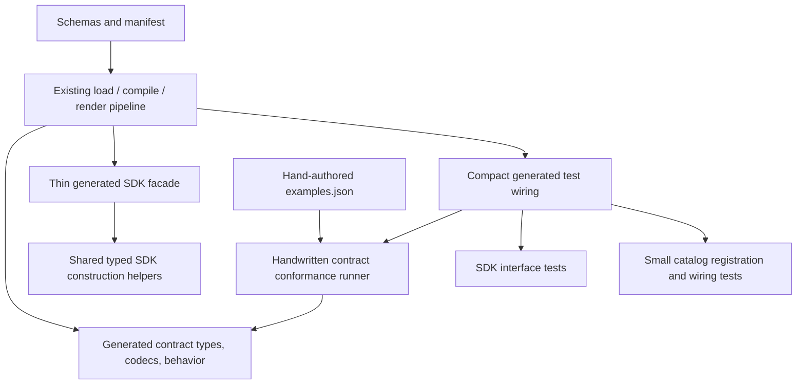

# Entity-type Codegen Simplification and Test Effectiveness

- **Status:** Draft for deferred implementation; scope agreed, implementation design proposed
- **Effort:** XL overall; deliver incrementally
- **Related:** [Generated Entity-type behavior](generated-entity-type-behavior.md), [ADR 0015](../docs/adr/0015-generate-entity-type-behavior.md)
- **Scope decisions:** Improve tests and simplify generation; exclude performance investigation. Replace full catalog example replay with smaller registration and wiring checks, gated by demonstrated fault detection.

## Problem and evidence

The Entity-type generator has a useful authoring interface: schemas, a manifest, and language-neutral examples produce typed contracts, SDK facades, and core catalog assembly without handwritten per-type Go. Preserve that architecture.

The implementation repeats invariant SDK mechanics and emits long assertion blocks for every example. Test effort is uneven:

- `render_behavior.go` generates direct contract conformance checks from human-authored expected results.
- `render_catalog_conformance.go` replays much of the same corpus through the catalog, adding registration, operation wiring, and deadline coverage.
- `render_sdk_conformance.go` only exercises Observation construction. Schema-invalid values are rejected by a codec before reaching the constructor, so those examples do not test the constructor's own typed-input validation.
- Some generator tests inspect source substrings rather than execute emitted behavior. Existing generated tests do execute the built-ins; the gap is additional supported generator shapes and SDK-specific behavior.
- `catalog_test.go` already protects generic type erasure, normalization, absent operations, and support narrowing. Preserve those guarantees rather than recreate them for every built-in.

These findings come from a source review. No baseline tests, benchmarks, or deliberate faults were run during that review. Establish an executable baseline before implementation.

## Goals

1. Protect SDK behavior at the public typed facade, including invalid typed values and command routing.
2. Retain every existing contract example and its human-authored expected result.
3. Generate compact test wiring instead of repeated assertions.
4. Reduce catalog replay without losing registration, codec, operation, deadline, or outcome-wiring checks.
5. Handwrite invariant SDK construction mechanics once while retaining simple generated facades.
6. Demonstrate that representative semantic defects fail tests before and after simplification.

## Non-goals and invariants

- No runtime evaluator, CEL, plugin system, new DSL operators, general-purpose schema compiler, or template-framework rewrite.
- No performance optimization, benchmark campaign, codec validation removal, or caching redesign.
- No wire, persistence, Entity-type ID, schema, deadline, support, State, or Command semantic changes.
- Keep deterministic output, ownership-based orphan cleanup, and generation drift checks.
- Keep schemas authoritative and examples independent. Never calculate expected `valid` or `satisfied` flags from production behavior.
- Adding a built-in still requires no handwritten per-type Go, including tests.
- This is not a compatibility project. Preserve the current facade deliberately because changing its caller interface is unnecessary, not because legacy shims are required. Update any necessary internal callers directly.
- Do not add semantic example evaluation to the generator: generated executable tests remain the backstop. A second implementation of the DSL would create another oracle-maintenance problem.

## Proposed architecture



The generator remains one deep build-time module. No new compiler stages or runtime indirection are required. Shared testing code must not be imported by production contract or SDK files.

## Deliverables and ordering

| ID | Deliverable | Effort | Depends on |
| --- | --- | --- | --- |
| D1 | Establish baseline and SDK behavior tests | L | — |
| D2 | Execute synthetic generator fixtures and baseline fault checks | L | D1 |
| D3 | Introduce shared contract runner and compact generated wiring | L | D2 |
| D4 | Replace full catalog replay with registration/wiring checks | M–L | D3 |
| D5 | Extract invariant SDK construction helpers | M–L | D1, D4 |
| D6 | Repeat fault checks, validate, and record final evidence | M | D2–D5 |

Do not combine all deliverables into a single unreviewable regeneration. Review generated diffs at each step.

## D1: Test the SDK interface

Extend the SDK test renderer rather than adding handwritten tests to built-in facade packages.

### Observation and descriptor assertions

- Construct schema-invalid but Go-representable values directly or with ordinary `encoding/json`, not a validating codec. For example, brightness State `101` must reach `NewObservation` and be rejected.
- Distinguish wire-only invalid inputs (such as a string for integer State) from typed-invalid inputs. Contract tests own wire-only invalidity; do not claim SDK constructor coverage when typed construction is impossible.
- Test valid State, support-incompatible State, and invalid support.
- Assert emitted Entity ID, normalized value, acquisition time, optional source time, UTC formatting, and absence of unintended evidence linkage.
- Reject empty Entity ID, zero acquisition time, and a present zero source time. Assert `adapter.ValidationError` classification for constructor validation failures.
- Verify descriptor key, external ID, name, type ID, and normalized support.

### Command assertions

Invoke the returned `adapter.CommandHandler`; do not call the user handler directly.

- A valid command invokes exactly the intended handler once and preserves command ID, correlation ID, Entity ID, deadline, and typed parameters.
- Schema-invalid and support-invalid parameters invoke no handler.
- Wrong Entity ID and unknown operation invoke no handler.
- Missing required handlers fail construction.
- Optional operation present with no handler fails; absent operation with a handler fails; absent operation is not routable.
- Preserve current behavior when a constructed handler has no routes: construction fails. Do not introduce an empty no-op handler.
- Use fixed times, synchronous calls, and a recording responder where required; no NATS, hardware, sleeps, or wall-clock deadlines.

Generic mechanics belong in `sdk/adapter/typed` tests. Generated tests prove facade wiring and instantiate type-specific values. Cover optional/multiple-operation cases through synthetic fixtures if no built-in exercises them.

## D2: Executable generator fixtures and fault evidence

Add a small fixture matrix covering operation-free, required operation, optional operation, and multiple operations with distinct parameter shapes. Include nested/optional State fields and arrays where the current emitter supports them; do not expand schema support to satisfy the fixture.

Generated fixture output must compile and execute, not merely pass `go/format` or file-existence checks. Materialize fixtures in a temporary module with a local `replace` to this repository and the minimum catalog scaffolding needed for generated catalog files. Keep them out of built-in discovery and committed production outputs. Test subprocesses must be offline after ordinary module preparation, bounded, and must not recursively launch the entire repository suite.

Expose this focused compilation/execution through a mise task; do not hide expensive repository-wide nested tests inside every generator unit test. Keep cheap compiler rejection tests in the ordinary Go suite. Replace source-substring assertions when execution establishes the same semantic guarantee; retain source checks for contractual output shape such as exact embed paths.

### Fault matrix

In an isolated worktree or copied checkout, record the test that fails for each fault:

| Fault | Required detecting surface |
| --- | --- |
| Remove supported-State validation | Direct contract and relevant SDK constructor test |
| Skip command parameter validation | SDK command test; no handler invocation permitted |
| Swap operation routing or parameter decoder | Multi-operation executable fixture |
| Drop hue wraparound or change tolerance boundary | Human-authored contract outcome examples |
| Drop the active-State conjunct | Contract outcome examples |
| Omit a built-in registration | Independent inventory-versus-catalog check |
| Wire a different deadline or outcome matcher | Catalog wiring test |
| Lose normalized value or timestamp during helper extraction | SDK construction assertions |

Mutate generator/renderer logic and regenerate for compiler faults. A freshness-check failure or compilation error alone does not establish semantic fault detection: record the executable behavioral failure where the faulty output still compiles. Do not regenerate expected results. Run final faults after refactoring too. Use existing `mutation-test` tooling where suitable, but isolated manual semantic faults are sufficient; no new mutation framework is required.

## D3: Shared contract conformance runner

Owner: new test-support package `internal/entitytypetest`. Keep it focused on Entity-type contract tests. It must not import the generator command package, SDK, or devices module, and it must not evaluate the manifest DSL.

Proposed new interface in `internal/entitytypetest/conformance.go`:

```go
// ContractProbe exposes observable contract behavior to example tests.
type ContractProbe struct {
    ValidateSupport func(json.RawMessage) error
    ValidateState   func(support, state json.RawMessage) error
    Operations     map[string]OperationProbe
}

// OperationProbe tests one operation without deriving expected outcomes.
type OperationProbe struct {
    ValidateParameters func(support, parameters json.RawMessage) error
    Satisfies          func(parameters, state json.RawMessage) (bool, error)
}

func RunContractExamples(t *testing.T, examplesJSON []byte, probe ContractProbe)
```

- Parse the existing `examples.json` shape in the runner; no authoring-format change. Use private structs matching `cases`, `support`, `states`, `operations`, `parameters`, and `outcomes`.
- Retain generator-side example-shape and coverage validation. The runner independently rejects malformed input, missing callbacks, unknown operations, and empty case sets rather than silently skipping them.
- Preserve all cases and flags. Report type/package context through the caller and named subtests for case, operation, category, and example index.
- Generate test-only embedding of the manifest's exact examples path. Leave production schema embedding unchanged.
- Generate one typed callback per operation, not one assertion block per example. Callbacks decode/validate inputs and return actual errors or outcomes; only the handwritten runner compares expected results.
- Outcome callbacks schema-decode recorded parameters and State but must not revalidate against mutable current support.
- Test the runner using deliberately wrong probe callbacks and fixed expected fixtures, independent of the generator. A missing or skipped category must fail the runner tests.

Existing `renderConformanceTest` retains its entry point but delegates source assembly to a focused `render_contract_conformance.go`. Remove the old expanded implementation from `render_behavior.go` in the same change. This is a move, not a parallel legacy path.

## D4: Smaller catalog registration and wiring checks

Replace `TestGeneratedBuiltinCatalogConformance` with compact generated registration/wiring tests. Preserve the handwritten generic catalog tests.

For each discovered type:

1. Normalize valid support and one valid State; verify normalized JSON, not just absence of error.
2. For each operation, resolve one valid command and assert normalized parameters and manifest deadline.
3. Check one satisfied and one unsatisfied outcome through `TypeCatalog.Satisfies`.
4. When the authored examples include support-invalid inputs, retain a representative rejection that protects support-validator wiring rather than merely schema rejection.
5. Check representative equal and unequal State values through the catalog; retain existing support-narrowing tests in `catalog_test.go`.

Selection is deterministic in source order. For selecting a support-invalid case, schema-decode first and use the authored `valid:false` flag; do not use production validation to compute the expectation. The full matrix remains at the contract seam.

Add a handwritten inventory test in `internal/modules/devices/catalog_test.go` that discovers `entitytypes/*/entitytype.json` independently of the generated registration list and checks that the actual catalog has exactly those IDs and operation names. In package `devices`, inspect the catalog's existing private maps rather than adding production introspection APIs only for tests. Resolve repository paths from the test source location, not an assumed shell working directory. This test must catch a generator dropping both registration and its generated test.

Do not remove full replay until the baseline faults are detected by the replacement allocation. If a representative probe misses a wiring fault, strengthen that probe before deleting the replay.

## D5: Shared typed SDK construction helpers

Owner: existing `sdk/adapter/typed` package. Extract descriptor and Observation mechanics only; retain operation support selection and named handler wiring in generated code. Keep per-package codec compilation and caching unchanged.

Proposed additions in `sdk/adapter/typed/entity_construction.go`:

```go
type EntityObservationInput[State, Support any] struct {
    EntityID          string
    Support           Support
    State             State
    AdapterReceivedAt time.Time
    SourceUpdatedAt   *time.Time
}

func NewTypedEntityDescriptor[Support any](
    metadata adapter.EntityMetadata,
    typeID string,
    support Support,
    supportCodec *entitytypes.JSONCodec[Support],
) (adapter.EntityDescriptor, error)

func NewTypedEntityObservation[State, Support any](
    input EntityObservationInput[State, Support],
    stateCodec *entitytypes.JSONCodec[State],
    supportCodec *entitytypes.JSONCodec[Support],
    validateState func(Support, State) error,
) (adapter.Observation, error)
```

The helpers own current validation order, error classification, normalization, metadata copying, and time serialization. Generated wrappers compile codecs, construct the generic input, and pass the generated validator. Keep the existing facade `ObservationInput`, aliases, and public constructors so adapter authors do not assemble generic configuration. No new codec registry, configurable validation pipeline, handler framework, or speculative nil-dependency recovery is needed.

Generated command-construction errors may continue using their existing local error wrapper. Extract error wrapping only where it is part of the mechanics being moved; do not broaden the refactor for cosmetic uniformity.

D1 tests must pass unchanged after extraction. Shared helper tests cover generic constructor rules once; generated tests retain evidence that each facade supplies the correct codec, validator, type ID, and data.

## Project layout

```text
internal/
├── entitytypetest/                              # new — test-only contract runner
│   ├── conformance.go                          # new — probes, JSON cases, assertions
│   └── conformance_test.go                     # new — independent runner checks
├── cmd/entitytypegen/
│   ├── render_behavior.go                      # modify — remove moved test renderer
│   ├── render_contract_conformance.go          # new — compact contract test wiring
│   ├── render_sdk_conformance.go               # modify — SDK-specific assertions
│   ├── render_catalog_conformance.go           # modify — smaller wiring probes
│   ├── render_sdk.go                           # modify — call shared constructors
│   ├── main_test.go                            # modify — replace semantic text checks
│   ├── fixture_execution_test.go               # new — bounded generated-code execution
│   └── testdata/                               # new fixtures — supported compiler shapes
└── modules/devices/
    ├── catalog_test.go                         # modify — independent inventory checks
    └── zz_generated_entitytypes_test.go        # regenerate — compact wiring tests
sdk/adapter/
├── typed/
│   ├── entity_construction.go                  # new — shared typed constructors
│   └── entity_construction_test.go             # new — shared constructor behavior
└── <type>/zz_generated_facade*.go               # regenerate — wrappers and SDK checks
entitytypes/<type>/zz_generated_conformance_test.go # regenerate — runner wiring
mise.toml                                      # modify — focused fixture execution task
specs/entitytype-codegen-simplification.md        # update — implementation evidence/status
```

Update renderer orchestration/import handling only as necessary for these outputs. Domain types, transport interfaces, persistence models, and configuration shapes are unchanged because this work changes generation and verification, not product behavior.

## Acceptance criteria

- [ ] Baseline tests pass before refactoring; any existing failure is recorded separately.
- [ ] Every existing contract example still executes with its original expected result.
- [ ] SDK tests actually pass typed-invalid values to constructors and verify no command handler runs after invalid input.
- [ ] Operation-free, optional, and multiple-operation generated fixtures compile and execute through a mise task.
- [ ] Shared runner tests fail on skipped categories or deliberately wrong callback results.
- [ ] Full catalog semantic replay is replaced; independent inventory and compact wiring checks detect the specified faults.
- [ ] Catalog support-narrowing and immutable recorded-command outcome guarantees remain protected.
- [ ] Generated facades retain their caller interface, while invariant descriptor/Observation mechanics have one handwritten implementation.
- [ ] No handwritten per-type Go, production test-support imports, new DSL features, or new runtime evaluator is introduced.
- [ ] A second generation pass produces no diff; missing/stale/orphaned output checks still work.
- [ ] Representative semantic faults fail executable assertions both before and after simplification, with all temporary mutations removed.
- [ ] Generated test expansion and SDK construction duplication are visibly reduced; record before/after line counts as supporting evidence, not a target to game.
- [ ] `mise run validate` and the focused fixture task pass; the final diff contains only intended source and regenerated changes.

## Validation and evidence

Use repository mise tasks rather than invoking formatters, generators, lint, vet, or tests directly. For implementation checkpoints use `mise run validate`; focused existing checks include `mise run --skip-deps test` and `mise run --skip-deps generate-check`. The new fixture task invokes its bounded compile-and-execute test explicitly. Gremlins is already available through `mise run mutation-test`; check supported arguments before use.

Record baseline revision, commands/results, fixture matrix, each fault and its detecting test, skipped checks and reasons, and before/after generated footprint in this spec's implementation evidence section. Do not equate green tests, coverage percentage, or source drift failures with proven semantic fault sensitivity.

## Trade-offs and risks

| Choice or risk | Rationale / mitigation |
| --- | --- |
| Keep codegen rather than handwritten per-type implementations | Preserves shared authoring semantics and avoids moving duplication to adapters/core. |
| Shared runner instead of expanded tests | Assertion logic becomes independently testable; compact generated callbacks still require wiring tests. |
| Reduced catalog replay | Less duplication, but faulty representative selection could hide wiring defects; gate removal with the fault matrix. |
| Shared SDK helpers | Reduces invariant boilerplate, but can spread one bug to all types; retain helper tests and facade wiring checks. |
| Test-only fixture compilation cost | Keep fixtures small, offline, and bounded; expose a focused mise task instead of recursive full-suite runs. |
| Generator and tests share omissions | Independently discover built-ins and test the runner; human-authored expectations alone do not solve registration omissions. |
| Optional-input semantics change accidentally | Preserve existing pointer/presence behavior and no-route errors in executable fixtures. |
| Refactor grows into a framework | Limit interfaces to the concrete probes and two constructors above; reject unrelated abstractions. |

## Deferred work and resumption

Performance benchmarking, codec optimization, schema caching, and broader DSL design are explicitly deferred. They require separate evidence and scope approval.

No blocking scope questions remain. This document is a proposed implementation design, not a claim that refactoring or fault checks have been completed. On resumption, compare the referenced code to the current checkout, establish D1 baseline, and revisit only design details invalidated by intervening changes.

## Implementation evidence

Implementation not started. After writing this spec, `mise run validate` passed (including generation checks, formatting, module tidiness, lint, race tests, and vet). This validates the documentation-only checkout, not the proposed refactoring or fault sensitivity. Re-establish the baseline on resumption and populate D1–D6 evidence; do not mark implemented until acceptance criteria are verified.
